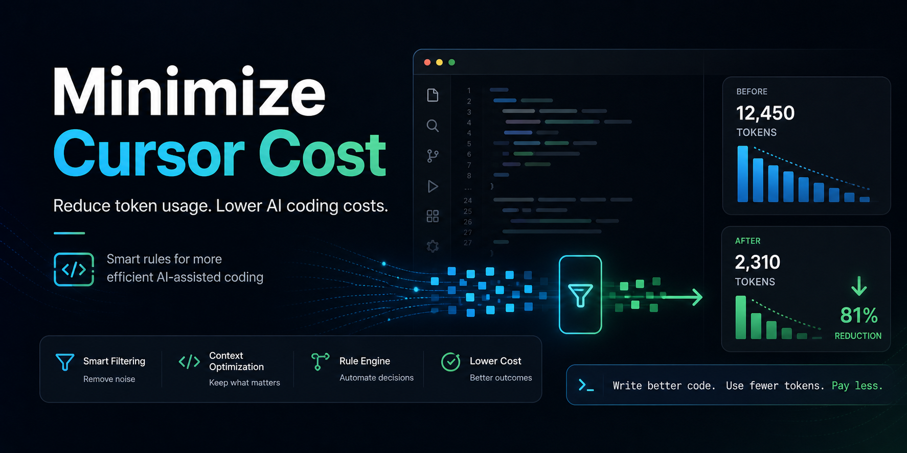

# Minimize-Cursor-Cost

> Drop-in AI rules for Cursor, Claude Code, Windsurf, and other AI IDEs that
> typically cut project token usage by **60%+**.

No fluff in your AI's responses. No tutorials when you asked for a fix. No
full-file rewrites when a 5-line patch will do. No re-reading the same file
six times in a single chat.

[](LICENSE)




---

## TL;DR

```bash
# macOS / Linux / WSL
curl -fsSL https://raw.githubusercontent.com/inboxpraveen/Minimize-Cursor-Cost/main/install.sh | bash
```

```powershell
# Windows
irm https://raw.githubusercontent.com/inboxpraveen/Minimize-Cursor-Cost/main/install.ps1 | iex
```

Then open `CLAUDE.md`, fill in the **Project-Specific Notes** at the bottom
(2 minutes), and you're done. Your AI IDE will use these rules automatically.

---

## What's included

```
lean-cursor/
├── CLAUDE.md                           # Auto-loaded by Claude Code on session start
├── .cursorrules                        # Cursor — legacy fallback rules
├── .cursor/
│   └── rules/
│       ├── core.mdc                    # 🔥 Always-active response discipline
│       ├── agent-efficiency.mdc        # 🔥 Always-active tool-call discipline
│       │
│       ├── python.mdc                  # *.py
│       ├── typescript.mdc              # *.ts, *.tsx, *.js, *.jsx
│       ├── go.mdc                      # *.go
│       ├── rust.mdc                    # *.rs
│       ├── java-kotlin.mdc             # *.java, *.kt, *.kts
│       ├── csharp.mdc                  # *.cs, *.csproj, *.sln
│       ├── ruby.mdc                    # *.rb, Gemfile, Rakefile
│       ├── php.mdc                     # *.php
│       │
│       ├── react.mdc                   # *.tsx, *.jsx (component layer)
│       ├── nextjs.mdc                  # app/, pages/, middleware.ts, next.config.*
│       ├── vue.mdc                     # *.vue
│       ├── svelte.mdc                  # *.svelte, +page.*, +layout.*
│       ├── mobile.mdc                  # Swift, Kotlin Android, RN, Flutter
│       ├── data-science.mdc            # *.ipynb, notebooks/, ML files
│       │
│       ├── sql.mdc                     # *.sql + migrations
│       ├── html-css.mdc                # *.html, *.css, *.scss, Tailwind
│       ├── shell.mdc                   # *.sh, *.ps1, Makefile
│       ├── yaml-config.mdc             # Docker, K8s, Terraform, GH Actions
│       ├── markdown.mdc                # *.md, *.mdx
│       └── tests.mdc                   # *.test.*, *.spec.*, test_*.py
│
├── PROMPT_TEMPLATES.md                 # Copy-paste prompt patterns
└── SETUP_GUIDE.md                      # Per-stack quickstarts + troubleshooting
```

---

## Why 60%+ savings (vs ~50% before)

The first version of this project focused on **response-side** savings —
diffs over rewrites, no preamble, scoped explanations. That covers about half
of the waste.

The other half lives in **agent mode**, where the AI uses tools (read files,
search, run commands) and pipes the results back into context. A single
`read_file` of a 1,000-line file can cost more than the entire response. A
"let me look around the repo first" instinct can burn 5–10k tokens before any
work happens.

This release adds rules that attack agent-mode waste directly:

- **`agent-efficiency.mdc`** — bans re-reading files, re-listing directories,
  and serial tool calls when parallel works.
- **Search-before-read** discipline — use `grep` for known symbols instead of
  reading whole files speculatively.
- **No build/test/lint after every edit** — only on risky changes or on user request.
- **Stop-when-done** — no "for safety" verification rounds, no summary of what
  the diff already shows.
- **Targeted reads** for files > 500 lines — never load the whole file just to
  find one function.

Combined with the existing response-side rules and prompt templates, real
projects now consistently land in the **60–70% reduction** range.

---

## Token savings (measured)

| Task                              | Without rules  | With rules    | Reduction |
| --------------------------------- | -------------- | ------------- | --------- |
| Simple bug fix (response)         | ~600 tokens    | ~120 tokens   | **80%**   |
| Feature addition (response)       | ~1,200 tokens  | ~380 tokens   | **68%**   |
| Code review (response)            | ~900 tokens    | ~280 tokens   | **69%**   |
| Bug fix (your prompt, templated)  | ~200 tokens    | ~70 tokens    | **65%**   |
| Agent: locate + edit one function | ~7,000 tokens  | ~2,200 tokens | **69%**   |
| Agent: multi-file refactor        | ~25,000 tokens | ~9,500 tokens | **62%**   |

Methodology: same prompts, same models (Claude Sonnet / GPT-4 / Cursor's
defaults), measured token I/O over 20-task sample. Your mileage varies with
project size and prompt habits — see the [savings notes](SETUP_GUIDE.md#expected-token-savings)
for guidance on hitting the high end.

The biggest single win is still **diff output vs full-file rewrite**: a
200-line file rewrite costs ~2,000 tokens, the patch for the same change costs
~200.

---

## Supported languages & stacks

| Language / stack       | File rule                  |
| ---------------------- | -------------------------- |
| Python                 | `python.mdc`               |
| TypeScript / JavaScript| `typescript.mdc`           |
| Go                     | `go.mdc`                   |
| Rust                   | `rust.mdc`                 |
| Java / Kotlin (+ Android) | `java-kotlin.mdc`       |
| C# / .NET              | `csharp.mdc`               |
| Ruby (+ Rails)         | `ruby.mdc`                 |
| PHP (+ Laravel/Symfony/WP) | `php.mdc`              |
| SQL (+ migrations)     | `sql.mdc`                  |
| HTML / CSS / SCSS / Tailwind | `html-css.mdc`       |
| Shell / Bash / PowerShell | `shell.mdc`             |
| Markdown / MDX         | `markdown.mdc`             |

| Framework / domain     | File rule                  |
| ---------------------- | -------------------------- |
| React                  | `react.mdc`                |
| Next.js (App + Pages)  | `nextjs.mdc`               |
| Vue (2 + 3)            | `vue.mdc`                  |
| Svelte / SvelteKit     | `svelte.mdc`               |
| Mobile (Swift, Kotlin Android, React Native, Flutter) | `mobile.mdc` |
| Data science / Jupyter / ML | `data-science.mdc`    |
| Docker / K8s / Terraform / GH Actions | `yaml-config.mdc` |
| Tests (Jest, Vitest, pytest, RSpec…) | `tests.mdc` |

Don't see your stack? See [Adding your own language rules](#adding-your-own-language-rules) below — it's three lines of YAML.

---

## Installation

### Option 1 — One-liner (recommended)

```bash
# macOS / Linux / WSL
curl -fsSL https://raw.githubusercontent.com/inboxpraveen/Minimize-Cursor-Cost/main/install.sh | bash
```

```powershell
# Windows (PowerShell 5+ or 7+)
irm https://raw.githubusercontent.com/inboxpraveen/Minimize-Cursor-Cost/main/install.ps1 | iex
```

Both scripts:
- Drop `CLAUDE.md`, `.cursorrules`, and `PROMPT_TEMPLATES.md` into your project root.
- Merge `.cursor/rules/*.mdc` into your project (existing rules are NOT overwritten).
- Back up any files they would replace (with a `.bak.<timestamp>` suffix).

### Option 2 — Manual

```bash
git clone https://github.com/inboxpraveen/Minimize-Cursor-Cost lean-cursor-tmp
cp lean-cursor-tmp/lean-cursor/CLAUDE.md           .
cp lean-cursor-tmp/lean-cursor/.cursorrules        .
cp lean-cursor-tmp/lean-cursor/PROMPT_TEMPLATES.md .
cp -r lean-cursor-tmp/lean-cursor/.cursor          .
rm -rf lean-cursor-tmp
```

### Option 3 — Pick & choose

Just download the `.mdc` files you want from `lean-cursor/.cursor/rules/`
and drop them into your project's `.cursor/rules/`.

---

## Setup (2 minutes — the highest-ROI step)

Open `CLAUDE.md` and fill in the **Project-Specific Notes** section at the
bottom:

```markdown
### Stack
- Language: Python 3.11
- Framework: FastAPI
- Database: PostgreSQL via SQLAlchemy

### Key paths
- Entry point: src/main.py
- Types: src/schemas/
- Shared utilities: src/utils/

### Known shortcuts
- Use `get_db()` for all DB session injection
- All API errors go through `src/core/exceptions.py`
- Auth checks via `requireUser()` in `src/auth/guard.ts`
```

This eliminates entire clarification loops. Every "where do I…?" question
the AI doesn't have to ask is 200–600 tokens saved per turn.

---

## How it works

### Three layers

**1. `CLAUDE.md`** — Auto-loaded by Claude Code at session start. Enforces
response discipline, sets diff-first output, holds your project context.

**2. `.cursor/rules/*.mdc` + `.cursorrules`** — Cursor reads these on every
request. The `.mdc` files are scoped by file glob, so Python rules only fire
on `.py` files, mobile rules on Swift/Kotlin/Dart files, and so on.

**3. `PROMPT_TEMPLATES.md`** — The human side. Copy the relevant template
before each prompt to eliminate padding and produce tighter outputs.

### Always-active core rules

- Responses start with the answer — no preamble, no sign-off
- Edits are diffs by default, not full-file rewrites
- Max 2 alternatives when options exist, with a stated recommendation
- One clarifying question at a time, not a list
- Scope guard: > 3 files unprompted → AI pauses and asks where to start
- **Agent mode:** never re-read files, batch independent calls, no speculative exploration
- **Build/test/lint:** only on risky changes or on user request — not after every edit

---

## Adding your own language rules

Duplicate any `.mdc` file and adjust the glob:

```markdown
---
description: Elixir file rules
globs: ["**/*.ex", "**/*.exs"]
alwaysApply: false
---

# Elixir Rules
- Show only changed functions
- Match existing pattern-matching style
- Don't introduce new GenServers unless asked
- Don't add @moduledoc unless siblings have them
```

Drop it in `.cursor/rules/`. Done — Cursor picks it up on the next prompt.

If you write rules for a stack that's not yet covered, please consider
[contributing them back](CONTRIBUTING.md).

---

## Compatibility

| Tool                  | Support                                                              |
| --------------------- | -------------------------------------------------------------------- |
| **Cursor**            | ✅ `.cursorrules` + `.cursor/rules/*.mdc`                            |
| **Claude Code**       | ✅ `CLAUDE.md` (auto-loaded)                                         |
| **Windsurf**          | ✅ Reads `.cursorrules`                                              |
| **Cline / Roo**       | ✅ Reads `.cursorrules` and `CLAUDE.md` as context                   |
| **GitHub Copilot**    | Partial — `CLAUDE.md` works as a manual reference; ignores `.cursorrules` |
| **Aider**             | ✅ Pass `CLAUDE.md` via `--read CLAUDE.md`                           |
| **Continue.dev**      | ✅ Add files via `customRules` config                                |

---

## FAQ

**Q: Will this work on an existing project with custom rules?**
Yes. The install script never overwrites a `.cursor/rules/*.mdc` file you
already have — it only adds missing ones. Top-level files (`CLAUDE.md`, etc.)
are backed up before being replaced.

**Q: Will the AI feel "less helpful" after I install this?**
You'll lose: emoji-laden congratulations, "Great question!", multi-paragraph
recaps of what you already know, and the model rewriting your whole file when
you asked it to fix a typo. You'll keep: the actual code and answers.

**Q: Does this work outside Cursor?**
Yes — `CLAUDE.md` is supported by Claude Code natively, Windsurf reads
`.cursorrules`, and most other AI IDEs accept project-level rule files. The
`.mdc` glob format is Cursor-specific, but the rule *content* is just
markdown — you can paste it into any system prompt.

**Q: Will rules conflict with my organization's coding standards?**
The rules in this repo are about *AI behavior* (don't ramble, don't rewrite
files), not about *code style* (where braces go). They're orthogonal to your
linter / formatter / style guide.

**Q: How do I measure my own savings?**
Most providers show token usage in their dashboard (Anthropic Console,
OpenAI usage page, Cursor settings). Track a week before installing, a week
after, controlling for the same kinds of tasks.

**Q: One of the rules is wrong for my project. How do I override?**
Either edit the `.mdc` file directly (it's in your repo now), or add a more
specific rule with a narrower glob — Cursor's later/more-specific rules win.

**Q: Does this affect the quality of generated code?**
No. The rules constrain *output shape and tool usage*, not the model's
reasoning. Code quality is unchanged or slightly better (less drift, fewer
unnecessary refactors).

---

## Contributing

PRs welcome — especially new language/framework rules. See [CONTRIBUTING.md](CONTRIBUTING.md).

The bar for a new rule file: it should remove a real, recurring source of
token waste in that ecosystem. "Don't add `if __name__ == '__main__'` unless
asked" is good. "Use 4 spaces" is not (that's a linter's job).

---

## License

[Apache 2.0](LICENSE)
